# 🐍 Syncella Enterprises Pvt. Ltd.  

> **Innovating the Future, Today.**  
> Your trusted partner in technology, creativity, and sustainable business solutions.  

  

<div align="center">

<h1>Building the Brands of the Future</h1>


<a href="https://www.jilzo.com/"></a>

<br/>
<br/>


</div>

---

<details>
  <summary><b>Open Interactive Table of Contents</b></summary>

- **About Us**
- **Vision & Mission**
- **What We Do**
- **Core Values**
- **Tech Stack**
- **Company Workflow**
- **Bee Journey (Gamified)**
- **Architecture & Data Flow**
- **Roadmap & Timeline**
- **OKRs & Progress**
- **Company Snapshot**
- **Contact & Connect**
- **Motto**

</details>

---

## 🏢 About Us  
At **Syncella Enterprises Pvt. Ltd.**, we’re a venture studio building bold, culture-defining startups that disrupt, connect, and scale. As the parent company of **JILZO** — a social‑first dating and party app for Gen Z — we operate at the intersection of technology, community, and youth culture. We back daring ideas with strategic execution, storytelling, and a long‑term vision.  

🔹 Founded in: 2025  
🔹 Headquarters: Mumbai, Maharashtra  
🔹 Industry: Technology, Information and Media  
🔹 Company size: 2–10  
🔹 Core Focus: **Venture Studio | Consumer Tech | Community & Culture**  

> Source: [Syncella Enterprises Pvt. Ltd. on LinkedIn](https://www.linkedin.com/company/syncellaenterprises/)  

---

## 🎯 Vision & Mission  

**🌍 Vision**  
To become a **globally recognized enterprise**, driving innovation and shaping industries with impactful, sustainable solutions.  

**🚀 Mission**  
- Deliver **future-ready products & services**.  
- Empower businesses with **strategic digital transformation**.  
- Build a community based on **trust, collaboration, and innovation**.  

---

## 💡 What We Do  

| Domain              | Services Offered |
|---------------------|------------------|
| **Technology**      | Web & Mobile Apps, Enterprise Solutions, SaaS Platforms |
| **Consulting**      | Strategy, Market Research, Growth Hacking |
| **Creative**        | Branding, UI/UX Design, Digital Marketing |
| **Innovation**      | AI/ML Solutions, Automation, Cloud & IoT |

---

## 🧩 Core Values  
✔ **Innovation First** – Think beyond boundaries  
✔ **Excellence Always** – Quality in every detail  
✔ **People Centric** – Clients, partners, and employees matter  
✔ **Integrity** – Transparent and ethical in all dealings  
✔ **Sustainability** – Solutions built to last  

---

## 🛠️ Tech Stack  

  
  
  
  
  
  
  
  

---

## 📊 Company Workflow (Diagram)  

```mermaid
flowchart TD
    A[Client Idea 💡] --> B[Syncella Team 🤝]
    B --> C{Strategy & Planning}
    C -->|Tech| D[Development ⚙️]
    C -->|Design| E[UI/UX 🎨]
    D --> F[Testing ✅]
    E --> F
    F --> G[Launch 🚀]
    G --> H[Growth & Support 📈]
```



---

## 🐝 The Syncella Bee Journey — Playful, Purposeful, Always in Motion

```mermaid
flowchart LR
    subgraph HIVE["Community Hive 🧡"]
      H1((Creators)):::h
      H2((Partners)):::h
      H3((Founders)):::h
    end

    A([Idea Nectar 💡]) --> B{Design & Strategy}
    B --> C[[MVP Build ⚙️]]
    C --> D[/Playtests & Events/]
    D --> E[[JILZO Beta 🚀]]
    E --> F{Feedback Loop ♻️}
    F -- refine --> B
    E --> G([Growth & Distribution 📈])
    G --> HIVE

    classDef h fill:#ffefc2,stroke:#f4b400,color:#333;
```



> Imagine the bee flying across nodes: Ideate → Build → Test → Launch → Grow → Back to Strategy.

---

## 🧭 Company Snapshot

| **Website** | **Status** | **Focus** | **HQ** |
|---|---|---|---|
| [jilzo.com](https://www.jilzo.com/) | Raising angel/early-stage capital | Gen Z social, events, nightlife | Mumbai, IN |

> Source: [Syncella Enterprises Pvt. Ltd. on LinkedIn](https://www.linkedin.com/company/syncellaenterprises/)  

---

## 🏛️ High‑Level Architecture

<details>
  <summary><b>Open Architecture Flow</b></summary>

```mermaid
flowchart LR
  subgraph Client Apps
    Web[Web App (Next.js)]
    Mobile[Mobile App]
  end

  Web --> API
  Mobile --> API

  subgraph Platform
    API[(API Gateway / BFF)]
    SVC1[User Service]
    SVC2[Events/Parties Service]
    SVC3[Recommendations/Matching]
    SVC4[Notifications]
    QUEUE[(Event Bus/Queue)]
  end

  API --> SVC1
  API --> SVC2
  API --> SVC3
  API --> SVC4
  SVC2 -- emits --> QUEUE
  SVC3 -- consumes --> QUEUE

  subgraph Data Layer
    DB[(PostgreSQL / MongoDB)]
    Cache[(Redis)]
    Lake[(Analytics Lake)]
  end

  SVC1 --> DB
  SVC2 --> DB
  SVC3 --> DB
  SVC4 --> DB
  SVC3 --> Cache
  SVC1 --> Lake
  SVC2 --> Lake
  SVC3 --> Lake
```

</details>

<details>
  <summary><b>User Journey (Sequence Diagram)</b></summary>


</details>

<details>
  <summary><b>Ecosystem ER Diagram</b></summary>


</details>

<details>
  <summary><b>Lifecycle State Machine</b></summary>

```mermaid
stateDiagram-v2
  [*] --> Ideation
  Ideation --> MVP
  MVP --> Beta
  Beta --> Launch
  Launch --> Scale
  Scale --> [*]
  Beta --> Ideation: Pivot
```

</details>

<details>
  <summary><b>Git Graph — Team Workflow</b></summary>


</details>

---

## 🗺️ Roadmap & Timeline


---

## 🎯 OKRs & Progress

- **MAU**: ████████░░ 80% of Q1 target  
- **Creator signups**: ██████░░░░ 60%  
- **Event partners**: ███████░░░ 70%  
- **Retention (D30)**: █████░░░░ 50%  

> We prioritize conversations over vanity metrics — impact over hustle.

---

## 📞 Contact Us

📧 **General:** [syncellaenterprises@gmail.com](mailto:syncellaenterprises@gmail.com)  
🤝 **Partnerships:** partnerships@syncella.co  
💼 **Careers:** careers@syncella.co  
💸 **Investors:** investors@syncella.co  
🌐 **Website:** [https://www.jilzo.com](https://www.jilzo.com)  
📍 **Location:** 4VG4+M2Q, Mumbai, Maharashtra  
📞 **Phone:** +91 7977876609  

<details>
  <summary><b>How we can collaborate</b></summary>

- Co‑host Gen Z community events
- Brand partnerships and collabs
- Creator onboarding and showcases
- Pilot new features with your audience

</details>

---

## 🌍 Connect With Us

* [LinkedIn](https://www.linkedin.com/company/syncellaenterprises/)
* [Website](https://www.jilzo.com/)
* [Email](mailto:syncellaenterprises@gmail.com)

---

## ✨ Motto

> *Syncella Enterprises Pvt Ltd – Turning Ideas into Impact.*


---